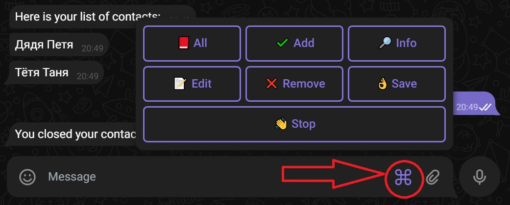

# Телеграм бот "Телефонный справочник"
Этот бот служит своего рода телефонной контактной книжкой.
Результаты работы записывает в файл JSON, данные берет оттуда же.

## С ботом можно общаться через интерфейс с иконками.


## Также предусмотрены следующие команды: 
```
/start - запуск бота
/stop - остановка бота
/all - показать все контакты
/add - добавить контакт
/save - сохранить прогресс
/full - узнать всю информацию о контакте, введя его имя
/remove - удалить конткат из справочника
/edit - редактировать информацию о контакте
```
